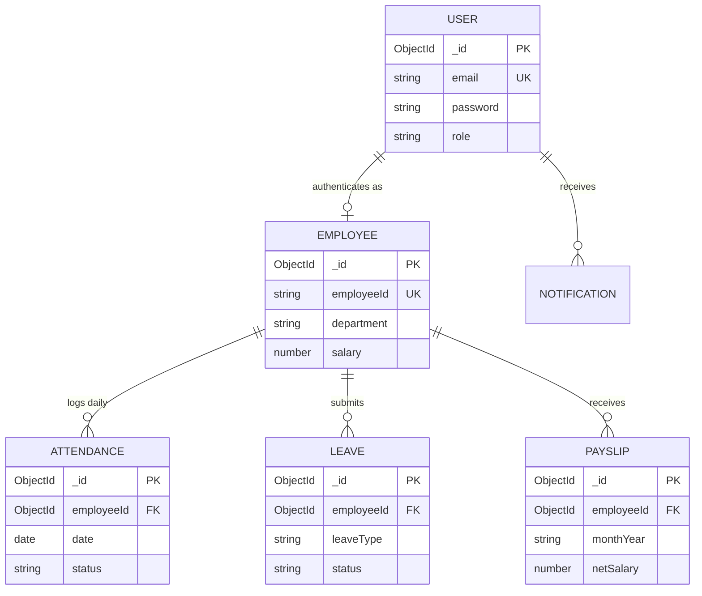

# 🏢 Enterprise Employee Management System (EMS)

> A production-grade, full-stack enterprise workforce platform featuring role-based HR workflows, real-time analytics, automated background processing, and an intelligent AI service layer.

[](https://nodejs.org/)
[](https://reactjs.org/)
[](https://vitejs.dev/)
[](https://tailwindcss.com/)
[](https://www.mongodb.com/)
[](./docs/testing.md)
[](./LICENSE)

---

## 1. Project Title
**Enterprise Employee Management System (EMS)** — Advanced Full-Stack Workforce Intelligence & Resource Management Platform.

---

## 2. Problem Statement
Traditional human resource administration in growing enterprises often suffers from fragmented data silos, slow paper-or-spreadsheet-based leave tracking, opaque compensation auditing, vulnerability to Insecure Direct Object Reference (IDOR) attacks, and a lack of actionable workforce analytics. Furthermore, HR teams spend excessive hours manually answering repetitive company policy inquiries and analyzing attendance patterns for burnout or absenteeism risks.

---

## 3. Objective
To design, engineer, and deploy a secure, modern, and production-ready enterprise platform that:
- Centralizes the entire employee lifecycle (onboarding, daily attendance, leave approvals, and payroll).
- Protects confidential employee compensation data with strict Role-Based Access Control (RBAC) and defense-in-depth security mitigations.
- Delivers real-time executive analytics and interactive visualizations computed directly from operational data.
- Provides asynchronous, event-driven background processing for transactional notifications and recurring tasks.
- Integrates a decoupled AI Intelligence service providing pattern detection (absenteeism, late arrivals, burnout risks) and a Retrieval-Augmented Generation (RAG) HR Policy Assistant.

---

## 4. Features

### 4.1 Core HR & Workforce Administration
- **Employee Directory**: Full CRUD with search, department filtering, pagination, and unique identity tracking (`EMP-XXX`).
- **Salary Data Protection**: Dynamic field-level redaction shields peer compensation; only authorized administrators have access.
- **Role-Based Access Control (RBAC)**: Distinct permissions for `admin` (supervisory & financial authority) and `employee` (self-service).

### 4.2 Attendance Management
- **One-Click Check-In / Check-Out**: Daily time-stamped attendance capture with location logging (Office vs. Remote) and optional notes.
- **Automated Work Hours**: Instant calculation of daily active duration and half-day / present status assignment.
- **Attendance Register**: Workforce-wide oversight for HR administrators and personal history registers for staff.

### 4.3 Leave Lifecycle
- **Leave Requests**: Employees apply for Casual, Sick, Earned, or Unpaid leaves with balance deductions.
- **Review & Approval**: Administrators approve or reject requests with audit remarks.
- **Self-Service Cancellation**: Employees can cancel pending requests (with strict IDOR ownership checks).

### 4.4 Automated Payroll
- **Itemized Payslip Generation**: Monthly earnings calculation (basic salary + allowances - deductions = net salary).
- **Disbursement Lifecycle**: Status progression across `Draft` &rarr; `Approved` &rarr; `Paid`.
- **Confidential Payslips**: Employees view and download their personalized payslips; peer access is strictly forbidden.

### 4.5 Real-Time Analytics Dashboard
- **Executive KPIs**: Total employees, active status, new hires, attendance percentage, absenteeism, and monthly payroll budget.
- **Interactive Visualizations (Recharts)**:
  - 30-day attendance trends
  - Department distribution breakdown
  - Leave utilization statistics
  - Workforce growth trajectory
  - Monthly payroll cost trends

### 4.6 Event-Driven Notifications & Workers
- **In-App Notification Center**: Real-time alerts for leave reviews, payslip releases, and announcements.
- **Asynchronous Background Workers**: Decoupled from HTTP requests via Inngest and Nodemailer.

### 4.7 AI Intelligence Layer
- **Workforce Pattern Insights**: Statistical pattern analysis flagging unusual absenteeism streaks, frequent late arrivals, and department burnout risks.
- **RAG HR Policy Assistant**: Interactive conversational agent grounded in official markdown policies (leave entitlement, attendance rules, payroll FAQs).
- **Strict Guardrails**: Non-autonomous advisory mandate (no automated hiring/firing) and prompt injection interception.

---

## 5. Architecture

The platform is designed following a multi-tier micro-modular architecture:

```mermaid
flowchart TD
    subgraph ClientTier["Frontend SPA (React 18 + Vite)"]
        UI[Tailwind CSS UI Components]
        State[Auth & Notification Contexts]
        AxiosClient[Axios Interceptors]
        UI --> State --> AxiosClient
    end

    subgraph SecurityShield["Security Perimeter"]
        RateLimiter[Sliding-Window Rate Limiter]
        Sanitizer[NoSQL & XSS Sanitizer]
        HelmetSec[Helmet CSP & HSTS]
        JWTAuth[JWT & RBAC Gatekeeper]
    end

    subgraph CoreBackend["Core Server (Node.js & Express)"]
        Routes[REST Endpoints]
        Controllers[Thin Controllers]
        Services[Fat Domain Services]
        Models[Mongoose Models]
        Routes --> Controllers --> Services --> Models
    end

    subgraph PersistenceLayer["Database"]
        MongoDB[(MongoDB Atlas / Local DB)]
        Models --> MongoDB
    end

    subgraph WorkerTier["Async Worker Engine"]
        InngestQueue[Inngest Event Bus]
        MailWorker[Nodemailer Worker]
        Services -.->|Emit Event| InngestQueue
        InngestQueue --> MailWorker
    end

    subgraph AIServiceTier["AI Microservice (Port 5001)"]
        Guardrails[Prompt & RBAC Guardrails]
        RAGRetriever[Vector Embeddings & Retriever]
        HRDocs[(Markdown Policy Docs)]
        Services <-->|Internal HTTP| AIServiceTier
        Guardrails --> RAGRetriever --> HRDocs
    end

    AxiosClient --> RateLimiter --> Sanitizer --> HelmetSec --> JWTAuth --> Routes
```

---

## 6. Tech Stack

### Frontend
- **Library & Framework**: React 18, Vite 5
- **Styling & UI**: Vanilla Tailwind CSS 3, Lucide React icons
- **Data Visualization**: Recharts
- **Routing**: React Router DOM (v6) with protected route guards
- **HTTP Client**: Axios with centralized request/response interceptors

### Backend
- **Runtime**: Node.js (v18+)
- **Framework**: Express.js
- **Database & ODM**: MongoDB, Mongoose
- **Authentication**: JSON Web Tokens (`jsonwebtoken`), `bcryptjs`
- **Security**: Helmet, CORS, custom sliding-window rate limiter, recursive NoSQL/XSS sanitizer
- **Background Jobs**: Inngest asynchronous event engine
- **Email Delivery**: Nodemailer

### AI Service
- **Architecture**: Decoupled Express microservice
- **Techniques**: Retrieval-Augmented Generation (RAG), vector similarity search, heuristic workforce pattern analysis, regex & policy safety guardrails

---

## 7. Database Design

The persistence tier consists of 7 interconnected Mongoose schemas with compound indexes:



*For complete collection specifications, compound indices, and ER diagrams, see [docs/database.md](./docs/database.md).*

---

## 8. API Documentation

| Resource | Methods | Endpoint | Description |
| :--- | :--- | :--- | :--- |
| **Auth** | `POST` | `/api/auth/login` | Authenticate credentials, returns Bearer JWT |
| **Auth** | `GET` | `/api/auth/me` | Current authenticated user profile |
| **Employees**| `GET`, `POST` | `/api/employees` | List directory / register employee |
| **Employees**| `GET`, `PUT`, `DELETE` | `/api/employees/:id` | Employee profile management |
| **Attendance**| `POST` | `/api/attendance/check-in` | Record daily check-in |
| **Attendance**| `POST` | `/api/attendance/check-out` | Record daily check-out & compute duration |
| **Leaves** | `GET`, `POST` | `/api/leaves` | View workforce leaves (admin) / Submit request |
| **Leaves** | `PUT` | `/api/leaves/:id/review`| Approve or reject leave request |
| **Payroll** | `GET`, `POST` | `/api/payroll` | List payroll records / generate payslip |
| **Payroll** | `GET` | `/api/payroll/my-payslips`| Access authenticated employee's payslips |
| **Dashboard**| `GET` | `/api/dashboard/admin` | Aggregate workforce analytics and chart series |
| **AI** | `GET` | `/api/ai/insights/dashboard`| AI workforce pattern and risk synthesis |
| **AI** | `POST` | `/api/ai/chat` | RAG HR Policy Assistant conversational search |

*For complete request/response schemas and parameters, see [docs/api.md](./docs/api.md).*

---

## 9. Authentication Architecture

- **Stateless Bearer Tokens**: HMAC SHA-256 JWT tokens containing `id`, `role`, and `employeeId`.
- **Password Security**: Strong hashing with `bcryptjs` (10 salt rounds) with timing attack resistance.
- **Role-Based Access Control (RBAC)**: Strict separation between administrative operations and self-service capabilities.
- **IDOR Protection**: Explicit identity matching on individual leave requests and payslips prevents lateral tenant traversal.
- **Field-Level Redaction**: Non-administrative queries to the employee directory automatically redact sensitive compensation values.

*For complete implementation details, see [docs/authentication.md](./docs/authentication.md).*

---

## 10. AI Architecture

The AI layer operates as a decoupled microservice running on port 5001:
- **Attendance Insights**: Analyzes streaks of unnotified absenteeism and frequent late arrivals.
- **Leave Insights**: Flags critical balance depletion and department-level leave clusters.
- **Non-Autonomous Operations**: Produces advisory signals for HR directors with zero automatic firing or disciplinary actions.
- **Security Guardrails**: Neutralizes prompt injections, enforces confidentiality, and prevents leaking sensitive compensation data.

*For details, see [docs/ai.md](./docs/ai.md).*

---

## 11. RAG Architecture

The conversational HR Assistant uses Retrieval-Augmented Generation (RAG) grounded in version-controlled enterprise documents:
1. **Document Corpus**: Standard policy files (`leave_policy.md`, `attendance_rules.md`, `payroll_faq.md`, `code_of_conduct.md`).
2. **Chunking & Embeddings**: Semantic text chunking with contextual overlap and numerical vectorization.
3. **Vector Similarity Matching**: Query matching via cosine similarity retrieves top-K grounded policy sections.
4. **Factual Synthesis**: Generates accurate, cited policy guidance without hallucination.

---

## 12. Installation

### Prerequisites
- **Node.js**: v18.0.0 or higher
- **NPM**: v9.0.0 or higher
- **MongoDB**: Local instance running on port 27017 or MongoDB Atlas connection string

### Setup Commands
```bash
# Clone the repository
git clone https://github.com/your-username/employee-management-system.git
cd employee-management-system

# Install dependencies across root, backend, frontend, and AI service
npm run install:all
```

---

## 13. Environment Variables

Create `.env` in the project root (or inside `server/`):

```env
# Server Configuration
PORT=5000
NODE_ENV=development
CLIENT_URL=http://localhost:5173

# Database (MongoDB Atlas or Local)
MONGO_URI=mongodb://127.0.0.1:27017/ems_db

# Security & Authentication
JWT_SECRET=super_secret_jwt_key_min_32_characters_random
JWT_EXPIRES_IN=7d
RATE_LIMIT_MAX_REQUESTS=300
AUTH_RATE_LIMIT_MAX=15

# Background Workers & Email
INNGEST_EVENT_KEY=local_inngest_key
SMTP_HOST=smtp.mailtrap.io
SMTP_PORT=2525
SMTP_USER=your_smtp_user
SMTP_PASS=your_smtp_pass
EMAIL_FROM=EMS Support <no-reply@ems.internal>

# AI Intelligence Service
AI_SERVICE_URL=http://localhost:5001
AI_SERVICE_API_KEY=local_ai_service_key
```

*A full template with production options is available in [.env.example](./.env.example).*

---

## 14. Running Locally

### Concurrently (Frontend + Backend)
```bash
# Starts backend on :5000 and frontend on :5173
npm run dev
```

### Starting Individually
```bash
# Start backend server
cd server && npm run dev

# Start frontend client
cd client && npm run dev

# Start decoupled AI service
cd ai-service && npm run dev
```

Visit the application at `http://localhost:5173`. Default seed accounts:
- **Administrator**:
  - **Email**: `anchal.keshri@ems.corp`
  - **Password**: `AdminPassword@2025`
- **Employee**:
  - **Email**: `sophia.chen@ems.corp`
  - **Password**: `EmployeePassword@2025`

---

## 15. Testing

The repository contains 12 automated test suites with 100% pass rate:

```bash
# Run all automated test suites
npm test

# Run tests in-band with coverage
npx jest --runInBand
```

### Test Coverage Highlights:
- **Security Audit (`security.test.js`)**: Rate limiting, NoSQL injection, XSS sanitization, IDOR checks, salary masking.
- **E2E Lifecycle (`e2e.workflow.test.js`)**: Full 12-step user journey from admin login to AI insight synthesis.
- **Domain Modules**: Authentication, Employees, Attendance, Leaves, Payroll, Dashboard, Notifications, AI.

*Detailed test execution matrix available in [docs/testing.md](./docs/testing.md).*

---

## 16. Deployment

The platform is engineered for cloud deployment:
- **Frontend**: [Vercel](https://vercel.com) with Single-Page Application rewrites (`client/vercel.json`).
- **Backend API**: [Render](https://render.com) or [Railway](https://railway.app) web services.
- **Database**: [MongoDB Atlas](https://cloud.mongodb.com) cloud replica set.

*Detailed deployment instructions and cloud checklists are available in [docs/deployment.md](./docs/deployment.md).*

---

## 17. Screenshots Section

| Dashboard & Real-Time Analytics | Employee Management & RBAC |
| :---: | :---: |
| Modern HR metrics, 30-day attendance trends, and payroll overview | Comprehensive workforce directory with role-based field masking |

| Attendance Check-In & Work Logs | Leave Request & Approval Workflow |
| :---: | :---: |
| One-click time tracking, active hours, and location logging | Dynamic balance calculation, admin review, and cancellation |

| Automated Itemized Payslips | AI Intelligence & RAG Policy Assistant |
| :---: | :---: |
| Itemized earnings, deductions, and confidential disbursement | Real-time absenteeism pattern detection and policy search |

---

## 18. Future Scope

1. **Biometric & Geo-Fencing Integration**: Mobile GPS check-ins and facial recognition attendance terminal integrations.
2. **Multi-Tenant SaaS Support**: Organizational tenant partitioning for multi-company payroll and leave management.
3. **Advanced Performance Appraisals**: 360-degree feedback reviews with AI-assisted goal tracking and KPI milestones.
4. **Third-Party Payroll APIs**: Direct banking integrations with Stripe, RazorpayX, or PayPal Payouts for direct deposits.
5. **Mobile Applications**: Native iOS and Android clients built with React Native utilizing the existing REST API.

---

## 📄 License
This project is open-source and available under the [MIT License](./LICENSE).
