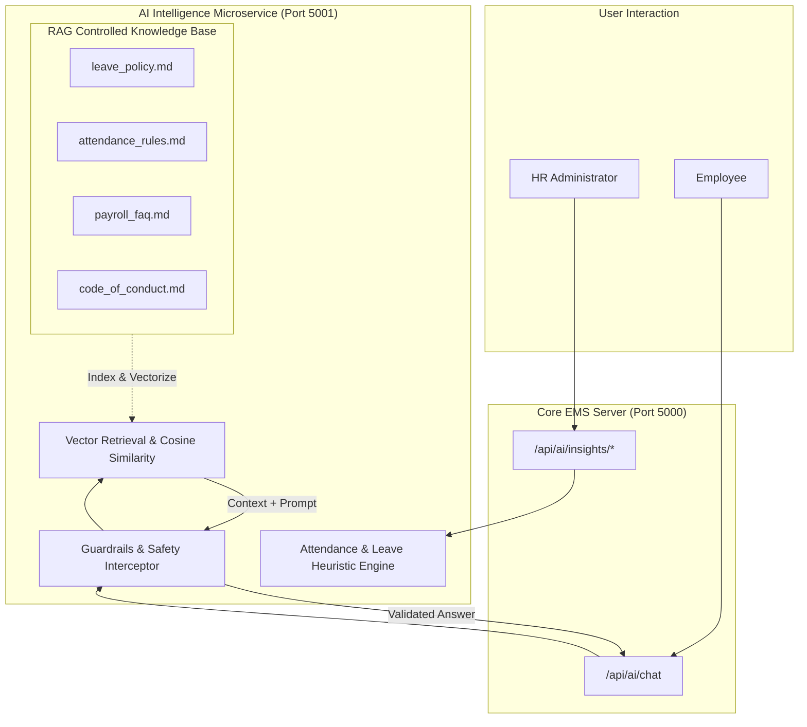

# AI Workforce Intelligence & RAG Architecture

## 1. Overview & Ethical Boundaries
The AI Intelligence layer in EMS provides assistive analytics and policy search without making autonomous or high-impact human resource decisions.

### Core Ethical Tenets:
1. **Advisory Role Only**: The AI engine generates trend alerts, risk signals, and procedure clarifications. It **never** executes automated hiring, firing, disciplinary, or salary alteration actions.
2. **Controlled Knowledge Base**: The HR Assistant uses **Retrieval-Augmented Generation (RAG)** strictly grounded in approved enterprise markdown policy documents. It does not fabricate policies or hallucinate procedures.
3. **Data Privacy & Guardrails**: Peer compensation is strictly shielded; prompt injection vectors are intercepted and neutralized.

---

## 2. Workforce Intelligence Engines

### 2.1 Attendance Pattern Analysis (`attendanceInsights.js`)
Evaluates raw attendance logs using non-intrusive statistical heuristics:
- **Consecutive Absenteeism Streaks**: Detects patterns exceeding 3 unnotified absent days and flags for managerial wellness check-ins.
- **Frequent Late Arrivals**: Flags employees with &ge; 4 late check-ins within a 30-day window.
- **Department Attendance Velocity**: Aggregates attendance percentages across departments to highlight systemic engagement dips.

### 2.2 Leave Utilization & Burnout Prevention (`leaveInsights.js`)
Analyzes quarterly leave activity to maintain team health:
- **High Utilization & Balance Depletion**: Flags employees whose remaining annual balance is critical (&lt; 2 days remaining).
- **Cluster Leave Spikes**: Flags departments where &gt; 30% of personnel have concurrent pending leave requests for the same date window.
- **Zero-Leave Burnout Signal**: Identifies staff with zero leave taken in &gt; 90 days to encourage work-life balance.

---

## 3. Retrieval-Augmented Generation (RAG) Architecture

### 3.1 Controlled Document Corpus (`ai-service/documents/`)
The knowledge base consists of curated, version-controlled markdown specifications:
- `leave_policy.md`: Annual entitlements, carryover rules, approval timeframes.
- `attendance_rules.md`: Shift timings, grace periods, remote work parameters.
- `payroll_faq.md`: Salary disbursement schedules, tax deductions, reimbursements.
- `code_of_conduct.md`: Professional ethics, harassment policies, grievance procedures.

### 3.2 Chunking & Vector Search (`retriever.js` & `embeddings.js`)
1. **Document Chunking**: Documents are split into semantic chunks (average 200–400 tokens) with 50-token contextual overlaps.
2. **Embedding Generation**: Text chunks are converted into numerical vector representations.
3. **Retrieval**: When a query arrives, the cosine similarity between the query embedding and document chunks is computed.
4. **Top-K Selection**: The top 3 most relevant chunks are extracted as grounding context for the answer generator.

---

## 4. Guardrails & Safety Architecture (`guardrails.js`)

Before any user input is processed, it passes through strict regex and rule-based guardrails:
1. **Prompt Injection Defense**: Intercepts phrases like `"ignore previous instructions"`, `"system prompt"`, `"jailbreak"`, or `"act as root"`.
2. **Confidentiality Guardrails**: Blocks queries asking for other employees' individual salary numbers, bank accounts, or disciplinary files.
3. **Output Sanitization**: Strips any accidentally leaked internal tokens, secrets, or system file paths before responding to the client.
