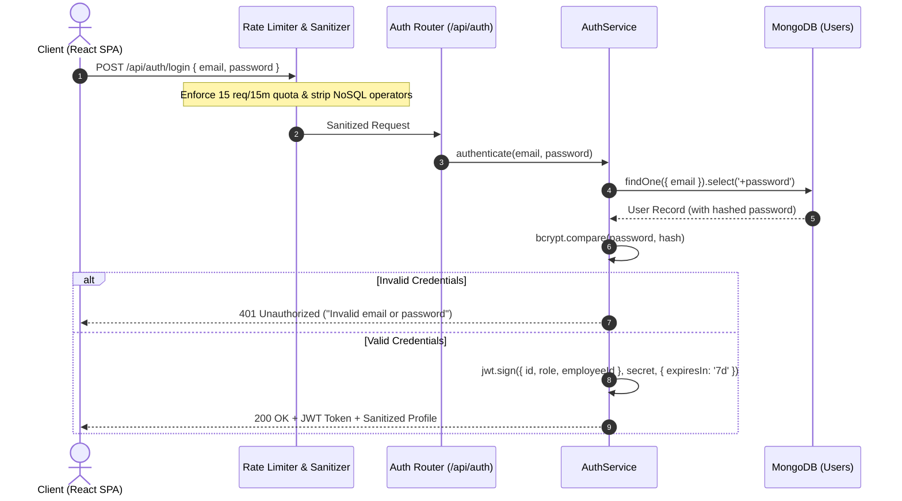

# Authentication, Authorization & Security Architecture

## 1. Overview
The Employee Management System (EMS) implements a multi-layered security architecture designed to prevent unauthorized access, privilege escalation, credential theft, and injection attacks. It adheres to OWASP Top 10 recommendations and NIST authentication guidelines.



---

## 2. Token Lifecycle & JWT Implementation

### 2.1 Token Issuance
- **Algorithm**: HMAC SHA-256 (`HS256`)
- **Payload Contents**:
  ```json
  {
    "id": "60d0fe4f5311236168a109ca",
    "role": "admin",
    "employeeId": "EMP-001",
    "iat": 1788700000,
    "exp": 1789304800
  }
  ```
- **Expiration**: 7 days default (configurable via `JWT_EXPIRES_IN`).
- **Signature Verification**: Validated on every protected request by `authMiddleware.js`.

### 2.2 Password Hashing
- **Library**: `bcryptjs`
- **Salt Rounds**: 10 rounds
- **Timing Attack Resistance**: Constant-time comparison ensures resistant behavior against timing analysis attacks.

---

## 3. Role-Based Access Control (RBAC)

The application enforces a two-tier hierarchical authorization model:
- **`admin`**: Full platform authority (HR Director / System Admin). Can create, update, and terminate employees, view workforce-wide salaries, approve/reject leaves, generate payroll, and inspect workforce AI intelligence.
- **`employee`**: Self-service authority. Restricted to logging own attendance, submitting leave requests, viewing own approved leaves, inspecting own itemized payslips, and querying the HR policy assistant.

### Middleware Implementation (`authMiddleware.js`):
```javascript
// Protect route - enforces valid JWT Bearer header
router.use(protect);

// Role enforcement - blocks unauthorized roles with 403 Forbidden
router.get('/admin', authorize('admin'), adminController.getData);
router.get('/workforce', authorize('admin'), employeeController.getAll);
```

---

## 4. Defense-in-Depth Security Mitigations

### 4.1 Insecure Direct Object Reference (IDOR) Prevention
Direct Object IDs (e.g., MongoDB ObjectIds for leaves or payslips) cannot be exploited across tenants:
- In `payslipService.getPayslipById(payslipId, requestingUser)`:
  - If `requestingUser.role !== 'admin'`, the service verifies that `payslip.employeeId` strictly matches the caller's `employeeId`.
  - Mismatch results in immediate `403 Forbidden` response.
- In `leaveService.cancelLeave(leaveId, requestingUser)`:
  - Caller must own the leave request; unauthorized cancellations are rejected with `403 Forbidden`.

### 4.2 Sensitive Salary Data Redaction
- In `employeeService.js`, the method `sanitizeEmployeeResponse` evaluates `requestingUser`:
  - If the caller is an `employee` viewing peer records or directory listings, the fields `salary` and `payslipSummary` are stripped from the JSON response before serialization.

### 4.3 Brute-Force & Rate Limiting (`rateLimiter.js`)
- Uses a sliding-window in-memory rate limiter:
  - **Login Route (`/api/auth/login`)**: Restricted to 15 attempts per 15-minute window per IP. Exceeding limits triggers `429 Too Many Requests` with `Retry-After` header.
  - **Global API (`/api/*`)**: Restricted to 300 requests per 15-minute window per IP.

### 4.4 Input Sanitization & Injection Defense (`sanitizer.js`)
- Recursively strips MongoDB query operator keys starting with `$` (e.g., `{"$gt": ""}`).
- Discards prototype pollution keys (`__proto__`, `constructor`, `prototype`).
- Strips `<script>`, `javascript:`, and DOM event handlers (`onerror`, `onload`) to prevent Stored and Reflected XSS.

### 4.5 Transport Security & HTTP Headers
Configured via `helmet` in `server/app.js`:
- `Strict-Transport-Security` (HSTS): Enforces HTTPS for 1 year (`max-age=31536000; includeSubDomains; preload`).
- `X-Frame-Options: DENY`: Mitigates clickjacking attacks.
- `X-Content-Type-Options: nosniff`: Prevents MIME-type sniffing.
- `Content-Security-Policy`: Restricts script and resource origins.
