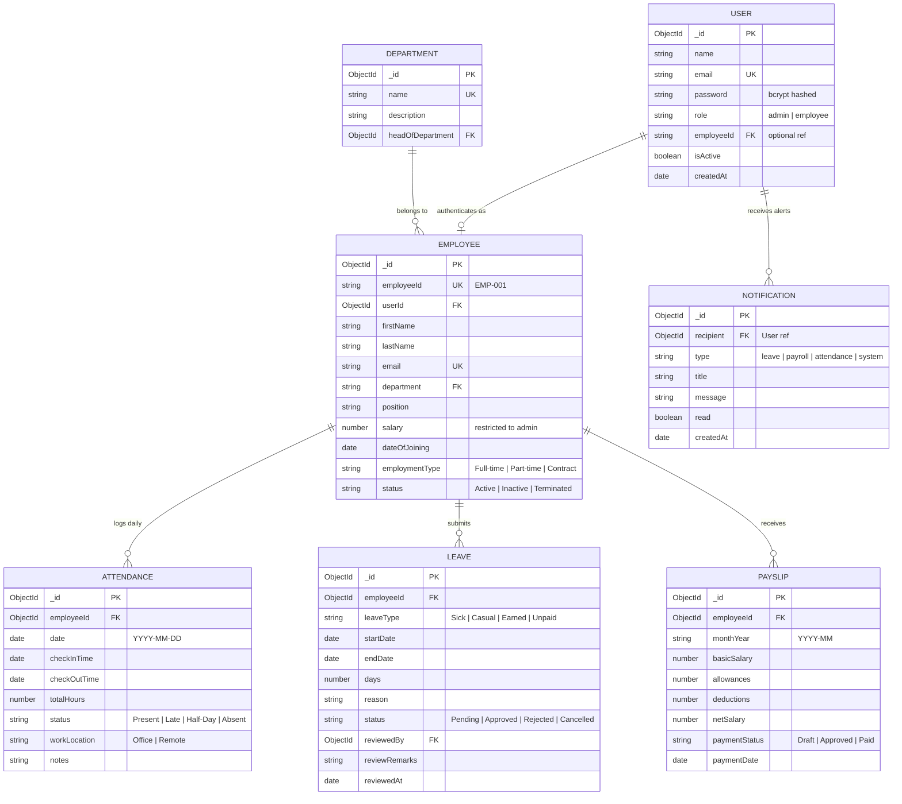

# Database Architecture & Entity-Relationship (ER) Documentation

## 1. Overview
The Employee Management System uses **MongoDB** as its primary persistence engine, managed via the **Mongoose ODM**. The database schema is engineered for data integrity, low-latency analytical aggregations, strict referential integrity through ObjectId references, and optimized indexing.

---

## 2. Entity-Relationship (ER) Diagram

---

## 3. Detailed Schema Definitions & Constraints

### 3.1 `users` Collection
Stores authentication credentials and high-level role authorizations.
- `_id`: ObjectId (Primary Key)
- `email`: String, required, unique, lowercase, trimmed, indexed.
- `password`: String, required, hashed with bcryptjs (min 10 salt rounds). Excluded from default queries (`select: false`).
- `role`: String, enum: `['admin', 'employee']`, default: `'employee'`.
- `employeeId`: String, reference to business identifier (e.g. `EMP-001`).
- `isActive`: Boolean, default: `true`.

### 3.2 `employees` Collection
Maintains comprehensive HR profile data.
- `_id`: ObjectId (Primary Key)
- `employeeId`: String, required, unique index. Format: `EMP-XXX`.
- `userId`: ObjectId, ref: `'User'`, required.
- `firstName`: String, required, trimmed.
- `lastName`: String, required, trimmed.
- `email`: String, required, unique index.
- `department`: String, required, indexed for fast filtering.
- `position`: String, required.
- `salary`: Number, required, min 0. Masked by service layer for peer access.
- `status`: String, enum: `['Active', 'Inactive', 'Terminated']`, default: `'Active'`.
- `dateOfJoining`: Date, default: `Date.now`.

### 3.3 `attendances` Collection
Tracks daily check-in/out timestamps and locations.
- `_id`: ObjectId (Primary Key)
- `employeeId`: ObjectId, ref: `'Employee'`, required.
- `date`: Date, required.
- `checkInTime`: Date, required.
- `checkOutTime`: Date, optional.
- `totalHours`: Number, default: 0. Computed automatically upon check-out.
- `status`: String, enum: `['Present', 'Late', 'Half-day', 'Absent']`, default: `'Present'`.
- `workLocation`: String, enum: `['Office', 'Remote']`, default: `'Office'`.
- **Compound Index**: `{ employeeId: 1, date: 1 }` (ensures one primary record per employee per day).

### 3.4 `leaves` Collection
Maintains leave requests, balances, and admin approval lifecycle.
- `_id`: ObjectId (Primary Key)
- `employeeId`: ObjectId, ref: `'Employee'`, required, indexed.
- `leaveType`: String, enum: `['Casual', 'Sick', 'Earned', 'Unpaid']`, required.
- `startDate`: Date, required.
- `endDate`: Date, required.
- `days`: Number, required, min: 0.5.
- `reason`: String, required, sanitized against XSS.
- `status`: String, enum: `['Pending', 'Approved', 'Rejected', 'Cancelled']`, default: `'Pending'`, indexed.
- `reviewedBy`: ObjectId, ref: `'User'`, optional.
- `reviewRemarks`: String, optional.

### 3.5 `payslips` Collection
Itemized payroll records and disbursement audit trail.
- `_id`: ObjectId (Primary Key)
- `employeeId`: ObjectId, ref: `'Employee'`, required, indexed.
- `monthYear`: String, required, format: `YYYY-MM`. Indexed.
- `basicSalary`: Number, required, min: 0.
- `allowances`: Number, default: 0.
- `deductions`: Number, default: 0.
- `netSalary`: Number, required, min: 0.
- `paymentStatus`: String, enum: `['Draft', 'Approved', 'Paid']`, default: `'Draft'`.
- **Compound Index**: `{ employeeId: 1, monthYear: 1 }` (prevents duplicate payslips for the same period).

### 3.6 `notifications` Collection
Asynchronous in-app notifications generated by background workers.
- `_id`: ObjectId (Primary Key)
- `recipient`: ObjectId, ref: `'User'`, required, indexed.
- `type`: String, enum: `['leave', 'payroll', 'attendance', 'system']`, required.
- `title`: String, required.
- `message`: String, required.
- `read`: Boolean, default: `false`, indexed.
- `createdAt`: Date, default: `Date.now`.

---

## 4. Aggregation Pipeline Strategies

The system uses optimized MongoDB aggregation pipelines in `dashboardService.js` to compute real-time HR KPIs without loading full collections into Node.js memory:
1. **Attendance Rate & Trends**: Aggregates daily attendance counts grouped by status (`$group` on `status` and `date`).
2. **Department Distribution**: `$group` by `$department` with `$sum: 1` and average compensation computations.
3. **Monthly Payroll Aggregation**: Sums `$netSalary`, `$basicSalary`, and `$allowances` filtered by target `monthYear`.
